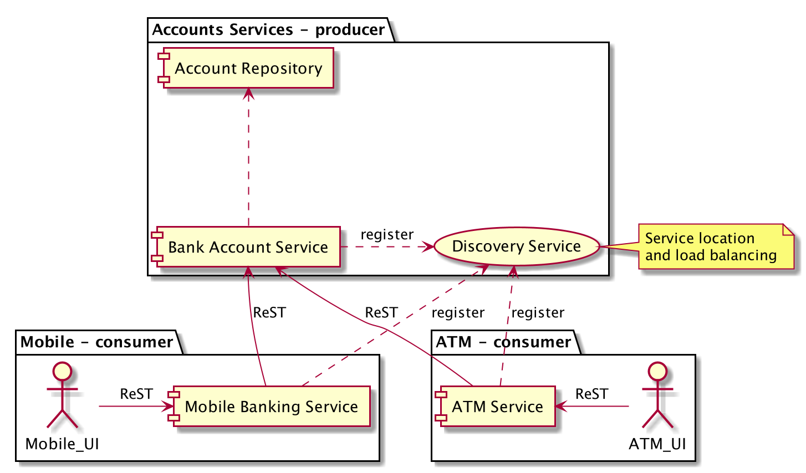

# Working with Consumer Driven Contracts

In this workshop you'll be using [contract testing](http://pact.io) to explore:

 * how to ensure the APIs you depend on don't change and accidentally break your applications
 * how to safeguard against accidentally breaking other peoples applications that rely on your APIs
 * how contract testing and other techniques can work together to give you confidence when working with external APIs
 * when contract testing can't be employed and when alternative techniques over other advantages

Although we'll work mainly with RESTful style APIs, the principles apply whenever some kind of API dependency exists (for example, depending on a distributed binary, a wire protocol or traditional RPC style APIs).

# Prerequisites

You will need Java and an IDE (we prefer Intellij IDEA). 

The project uses [Gradle](https://gradle.org/), you will either need to work with Gradle from the terminal or, in the case of IntelliJ IDEA, use the Gradle plugin. 

As we use Gradle, performing the steps below before the session will save time downloading various dependencies.

1. Clone the repository with the following command.

   `git clone https://github.com/xp-dojo/consumer-driven-contracts.git`
  
   If you have problems with SSL, you can try the following.
   
   `git clone -c http.sslVerify=false https://github.com/xp-dojo/consumer-driven-contracts.git`
   
   If you have problems with a proxy, you can `unset http_proxy` and `unset https_proxy` (or equivalent for your OS).

1. Open the project from IntelliJ IDEA (community edition is fine). 

   If you have the Gradle plugin installed, things should "just work". Gradle will download all the dependencies and you will see the project compile. Your millage may vary.

1. To test everything is compiling, navigate to `AccountService.java` (under the `account-service` folder) and run it as an application.

   You should see a green run icon to the left of the class declaration. If you don't or can't run it, speak to an instructor.

# Instructions

> **@Pete** can you sense check this and make sure i've got the right idea. We'll have some time to adjust but should if anything is way off!

## Start with the Consumer

Ensuring the APIs you depend on don't change and accidentally break your applications.

1. We want to include an account's description along with the account summary information in mobile app.

   There is a `description` attribute in `Account` and `AccountSummary`; it's returned by the `account-service` (producer) but is not currently used by any client (consumer). We'd like to include it in mobile application's contract when it gets account information.
   
   Add an **assertion** in the mobile app's _contract_ to verify the description field is valid. Run the test. **Hint:** look in `MobileConsumerAccountSummaryPactTest.java`. Ensure you have as assertion along the lines of `assertThat(account.getDescription()).isNotEmpty()`.
      
1. You should see the test fail until you simulate the server sending back the description.

   Add the description field to the expected response in the contract (`MobileConsumerAccountSummaryPactTest`). Re-run the test and see it pass.
 
   > This is simulating the server sending back an additional JSON field. Have a think how you could test if it actually is already.
 
1. Try preventing the server from sending the `description` field back in JSON. Does anything break for the mobile app?

   Remove or comment out the `account-service` code that returns the description. What happens?

1. Display the description in the mobile app. **Hint:** look in `accountSummaryView.html` and `accountListView.html`. 

## Build out the Producer

Safeguarding against accidentally breaking other peoples applications that rely on your APIs.

1. Having collected the contracts (as Pact JSON files) that are generated when running the tests (look in the `target` folder), ensure the `account-service` is using them in a test.

   Run the `account-service` contract tests.
   
1. Modify the `account-service` somehow so that the format, URLs or verbs have altered and re-run the tests.

   You should see a failure indicating that _known_ clients are relying on a _contract_ you no longer respect.

# Background

## Consumer Driven Contracts

All API's are contractual; they define how to make calls and what to expect in return. Formalising these contracts into some kind of external specification allows us to test consumers and producers of these APIs. There are lots of techniques we can use to do this, the previous session on [ATDD](https://github.com/xp-dojo/atdd-bank-account) is one example.

Consumer driven contracts or _contract testing_ is another technique whereby auto-generated "contracts" are executed against consumers and producers to ensure neither deviate.

## Architecture Overview

We will be continuing the Bank Account theme and have provided **three applications** and one **library jar**. 

 * The **central banking platform** uses the **bank account library** to manage a single user's accounts
 * The **Mobile application** allows user's to interact with thier accounts from their mobile device
 * The **ATM application** is installed on ATM branches and allows users to physically withdraw money and perform basic banking tasks
 
 
The project is split up into the following folders.

| Folder                   | Description              |
|--------------------------|--------------------------|
| `banking-service`        | Central banking platform |
| `atm-service`            | ATM application          |
| `mobile-banking-service` | Mobile application       |
| `bank-account`           | Banking library          |
| `discovery-service`      | Discovery services       |

The components and their interactions are shown below.

# Additional Reading

[Pack.io](https://docs.pact.io/) has lots of interesting background and useful information  
[Roy Fielding's orginal discussion of the RESTful architecture](https://www.ics.uci.edu/~fielding/pubs/dissertation/rest_arch_style.htm)  
